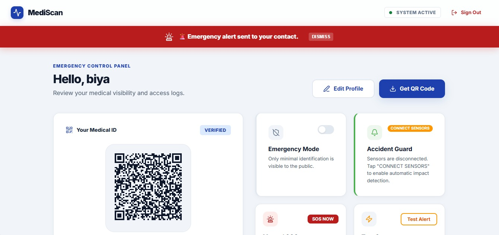
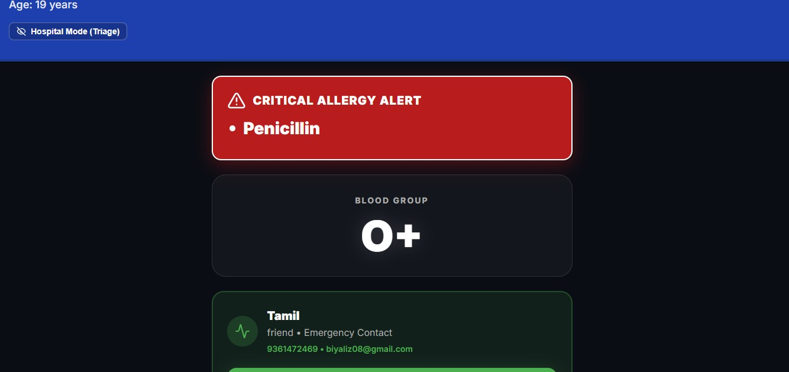

<div align="center">
  
  <h1>MediScan</h1>
  <p><i>Emergency Medical ID System</i></p>

  <p>
    
    
    
  </p>
</div>

MediScan is a cross-platform emergency medical identification system designed for rapid information retrieval in life-critical scenarios. The ecosystem consists of a **React Native (Expo) Mobile App** for patient management and accident detection, and a **Vite Web App** for responder access and profile administration.

### 📱 Main Project (Mobile App - Expo)
The root of this repository contains the **MediScan Mobile Application**, built with Expo SDK 54. 
- **Features**: Patient authentication, medical profile management, scannable QR generation, and real-time **Accident Detection** (impact sensing).
- **Tech Stack**: React Native, Expo, Supabase, EmailJS REST API.

### 🌐 Web Project (Web App - Vite)
Located in the `web_backup/` directory.
- **Features**: Patient landing page, emergency responder view, profile management, and desktop dashboard.
- **Tech Stack**: React, Vite, Tailwind CSS, Supabase.

---

### 🚀 Key Features
- **Dynamic QR Retrieval**: Unique patient identifiers mapped to real-time cloud records.
- **Accident Guard / SOS Alert**: Automatic impact detection with a 15-second cancellation window (Mobile).
- **Deep Linking**: QR codes use `mediscan://` to open the mobile app directly.
- **Emergency Priority**: High-readability responder view with one-touch calling for contacts.

---

### 📁 Project Structure
```text
mediscan/
├── screens/            # Mobile App screens (Landing, Dashboard, SOS)
├── components/         # Premium UI components (QR Card, Profile Banner)
├── services/           # Backend services (Supabase, Email, Sensors)
├── navigation/         # Expo Stack Navigation
├── web_backup/         # The original Vite Web application
└── App.tsx             # Mobile App entry point
```

---

### ⚙️ Setup & Installation

#### 1. Mobile App (Root)
```bash
# Clone the repository
git clone https://github.com/biyalizabraham08/mediscan.git
cd mediscan

# Install dependencies
npm install

# Run the app
npx expo start
```

#### 2. Web App (`web_backup/`)
```bash
cd web_backup
npm install
npm run dev
```

### 🔑 Environment Configuration
Create a `.env` file in the root for the Mobile app and in `web_backup/` for the Web app.
**Required Keys:**
- `EXPO_PUBLIC_SUPABASE_URL` / `VITE_SUPABASE_URL`
- `EXPO_PUBLIC_SUPABASE_ANON_KEY` / `VITE_SUPABASE_ANON_KEY`
- `EXPO_PUBLIC_EMAILJS_SERVICE_ID`
- `EXPO_PUBLIC_EMAILJS_PUBLIC_KEY`

---

### ⚠️ Disclaimer
MediScan is a technical demonstration and is **not** a production-grade medical record system. It has not undergone clinical auditing or regulatory compliance (e.g., HIPAA). All medical data is user-reported and should be verified by authorized personnel.

### 📸 Screenshots

*User Dashboard with QR Code and SOS Controls*


*Emergency Profile View with Contact Integration*

### ✍️ Author
[Biya Liza Abraham](https://github.com/biyalizabraham08)
